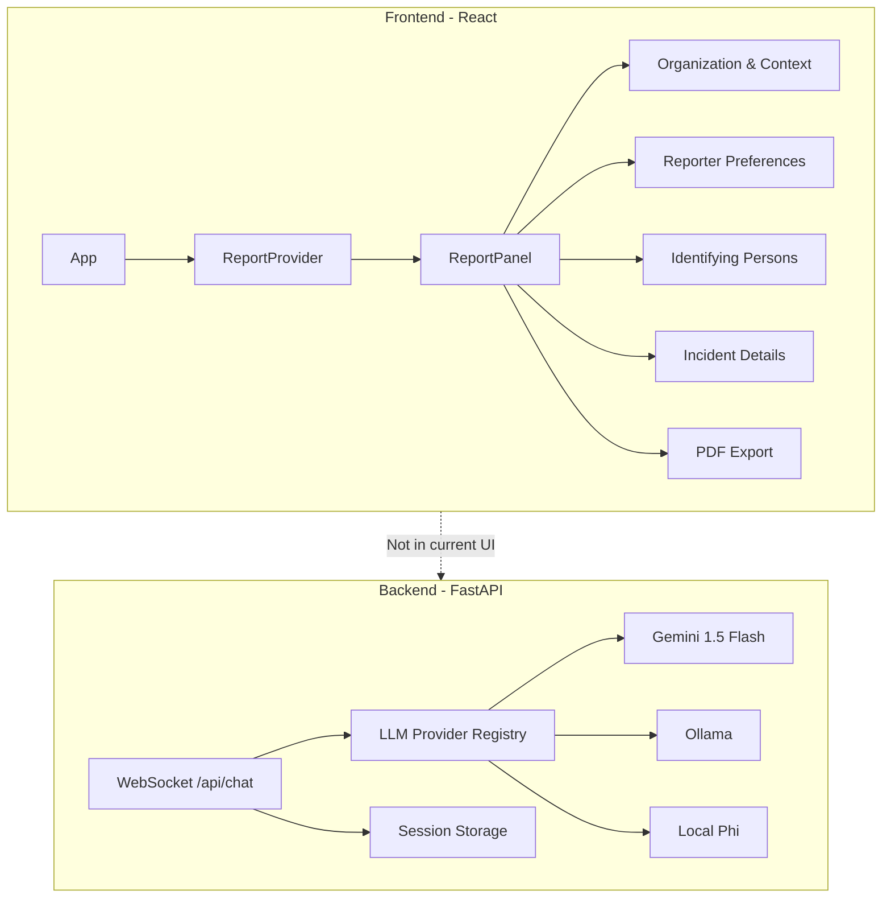
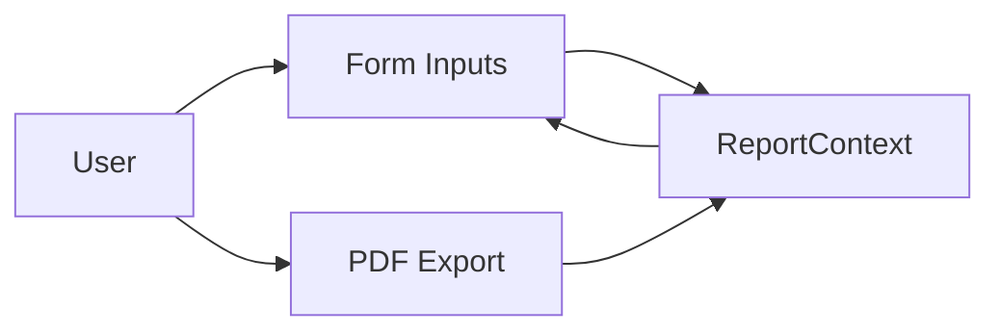

# ReportIQ Architecture

## Overview

ReportIQ is a whistleblowing report form application. Users fill out a structured report across four sections. A PDF can be exported from the form. An AI chat backend exists (WebSocket) but is not currently exposed in the UI.



---

## Tech Stack

| Layer | Technology |
|-------|-------------|
| Frontend | React 18, TypeScript 5.6, Vite 5 |
| Styling | CSS Modules, design tokens (index.css) |
| PDF | jsPDF (client-side) |
| Backend | FastAPI, Pydantic 2, Uvicorn |
| AI | Modular: Gemini 1.5 Flash (default) / Ollama / local Phi |
| Data | In-memory (React context + backend sessions) |

---

## Frontend Architecture

### Layout

Single-column layout: no sidebar. The main view is the report form.

```
App
├── ErrorBoundary
├── ReportProvider (ReportContext)
└── ReportPanel
    ├── Header ("Whistleblower Report")
    ├── FormSection: Organization & Context
    ├── FormSection: Reporter Preferences
    ├── FormSection: Identifying Persons and Management
    ├── FormSection: Incident Details
    └── Submit (PDF download)
```

### State Management

- **ReportContext**: Holds `ReportData` and `updateReport`. All form sections read/write via `useReport()`.
- **Report data**: In-memory only; lost on refresh.
- **PDF export**: Client-side via `generateReportPdf(report)` using jsPDF and `reportSchema.ts`.

### Report Sections

| Section | Key Fields |
|---------|------------|
| Organization & Context | organization_tier, country, incident_location |
| Reporter Preferences | is_employee, wish_anonymous, contact fields (conditional) |
| Identifying Persons | person_1..N (first, last, title), supervisor_involved, management_aware |
| Incident Details | general_nature, where_occurred, when_occurred, duration, how_aware, persons_concealing, full_details |

### AI Chat (Backend Only)

ChatPanel and ChatSidebar components exist but are not rendered in the current App. The backend WebSocket chat endpoint is available and can be used when the chat UI is re-enabled.

---

## Backend Architecture

### LLM Provider Registry

```
app/llm/
├── base.py       # LLMProvider protocol
├── registry.py   # get_provider() → active provider
├── gemini_provider.py   # Gemini 1.5 Flash (default)
├── ollama_provider.py   # Ollama (phi3.5)
└── local_phi.py        # llama-cpp Phi (local)
```

Provider is selected via `LLM_PROVIDER` env (`gemini` | `ollama` | `local`).

### Two-Layer Prompt Workflow

1. **Layer 1 (Classify)**: Classifies user message as `irrelevant` | `extract_data` | `clarification` | `complete` | `sensitive_support`.
2. **Layer 2 (Execute)**: Runs the appropriate prompt for that type; for `extract_data`, parses JSON and updates report.

### WebSocket API

- **Endpoint**: `WS /api/chat/{session_id}`
- **Client sends**: `{"type": "message", "content": "user text"}`
- **Server sends**: `{"type": "token", "content": "..."}` (streaming), `{"type": "report_update", "data": {...}}`, `{"type": "done"}`

### Storage

- **Session store**: In-memory per `session_id`. Holds conversation history and report state.
- **Embeddings**: Placeholder for policy quoting (gemini-embedding-001); not yet wired.

---

## Data Flow



Backend flow (when chat UI is used):

```
User → WebSocket → Chat Router → Layer1 Classify → Layer2 Execute → LLM Provider → Stream → Client
```

---

## Configuration

### Backend (`.env`)

| Variable | Required | Default | Description |
|----------|----------|---------|-------------|
| LLM_PROVIDER | No | gemini | gemini \| ollama \| local |
| GEMINI_API_KEY | When gemini | - | Google AI API key |
| OLLAMA_BASE_URL | When ollama | http://localhost:11434 | Ollama URL |
| OLLAMA_MODEL | When ollama | phi3.5 | Ollama model |
| MODEL_FILE, N_CTX, etc. | When local | - | llama-cpp settings |

### Frontend

- Design tokens in `index.css` (colors, spacing, type scale).
- API base URL via Vite proxy to `http://localhost:8000`.

---

## File Structure (Key Paths)

```
frontend/src/
├── App.tsx
├── context/ReportContext.tsx
├── components/ReportPanel/
│   ├── ReportPanel.tsx
│   └── sections/          # OrganizationContext, ReporterPreferences, etc.
├── data/reportSchema.ts   # PDF export schema
├── types/report.ts
└── utils/generateReportPdf.ts

backend/app/
├── main.py
├── config.py
├── llm/                   # Provider registry + implementations
├── prompts/               # Layer1, Layer2, formats
├── routers/chat.py
├── storage.py
└── models.py
```
