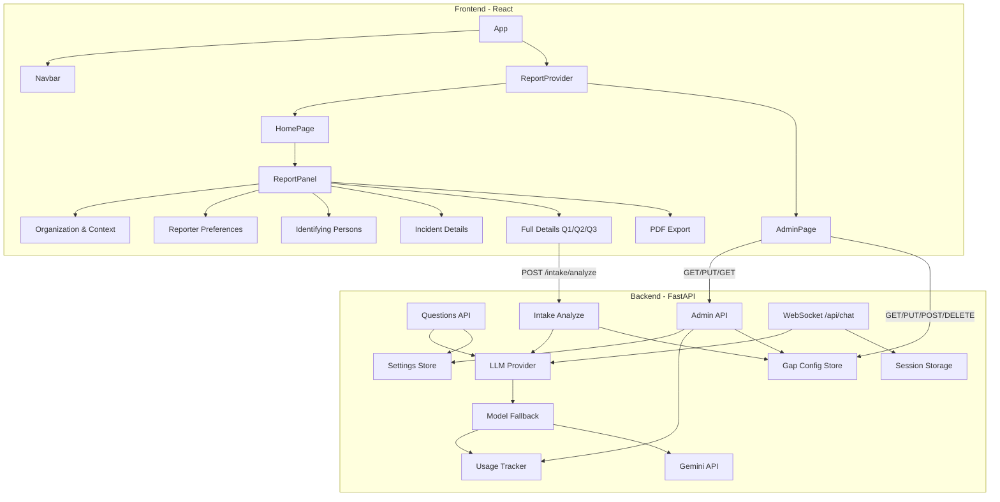
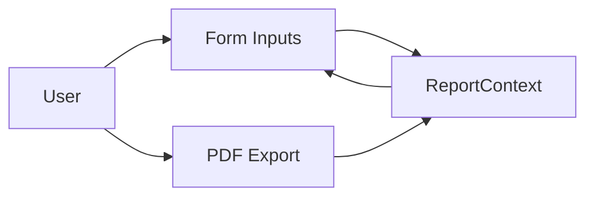
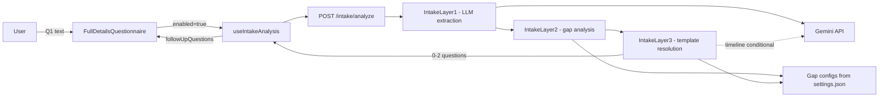

# ReportIQ Architecture

## Overview

ReportIQ is a whistleblowing report form application. Users fill out a structured report across four sections. The **Full Details** subsection drives a dynamic wizard powered by a 3-layer deterministic intake analysis pipeline: Q1 (free-text narrative) is analyzed by the backend, which returns 0–2 targeted follow-up questions; the user answers them, then reviews all answers. An Admin page lets administrators configure Q2/Q3 prompt templates, manage intake gap configurations, and monitor AI model quota usage. A PDF can be exported when the report is complete. A WebSocket chat backend exists for future chat UI integration.



---

## Tech Stack

| Layer | Technology |
|-------|-------------|
| Frontend | React 18, TypeScript 5.6, Vite 5, react-router-dom |
| Styling | CSS Modules, design tokens (`index.css`) |
| PDF | jsPDF (client-side) |
| Backend | FastAPI, Pydantic 2, Uvicorn |
| AI SDK | `google-genai` >= 1.0.0 (new Gen AI SDK, replaces deprecated `google-generativeai`) |
| AI Model | Gemini (default: `gemini-2.5-flash-lite`; fallback chain: `gemini-2.0-flash` → `gemini-2.5-flash-lite` → `gemini-1.5-flash`) |
| Embeddings | `models/text-embedding-004` via `google-genai` |
| Settings | JSON file (`backend/data/settings.json`) with file locking |
| Usage Tracking | JSON file (`backend/data/usage.json`) with file locking, 7-day retention |
| Data | In-memory (React context + backend sessions) |

---

## Frontend Architecture

### Routing

| Path | Component | Description |
|------|-----------|-------------|
| `/` | HomePage | Report form |
| `/admin` | AdminPage | Settings (Q2/Q3 prompt templates) + Model Usage stats |

### Layout

```
App
├── ErrorBoundary
├── ReportProvider (ReportContext)
├── Navbar (Home, Admin links)
└── Routes
    ├── / → HomePage
    │   └── ReportPanel
    └── /admin → AdminPage
```

### State Management

- **ReportContext**: Holds `ReportData` and `updateReport`. All form sections read/write via `useReport()`.
- **Report data**: In-memory only; lost on refresh.
- **PDF export**: Client-side via `generateReportPdf(report)` using jsPDF and `reportSchema.ts`.

### Report Sections

| Section | Key Fields |
|---------|------------|
| Organization & Context | organization_tier, country, incident_location |
| Reporter Preferences | is_employee, wish_anonymous, contact fields (conditional) |
| Identifying Persons | person_1..10 (first, last, title), supervisor_involved, management_aware |
| Incident Details | general_nature, where_occurred, when_occurred, duration, how_aware, persons_concealing, full_details_q1, full_details_q2, full_details_q3 |

### Full Details — Dynamic Intake Wizard

Within Incident Details, **Full Details** is a dynamic step wizard powered by the 3-layer intake pipeline:

| Step | Description | Report field |
|------|-------------|-------------|
| `q1` | User types free-text narrative | `full_details_q1` |
| `analyzing` | "Analyzing your report…" loading state — POSTs to `/api/questions/intake/analyze` | — |
| `fq1` *(optional)* | First follow-up question (if any returned) | `full_details_q2_question` (question text), `full_details_q2` (answer) |
| `fq2` *(optional)* | Second follow-up question (if any returned) | `full_details_q3_question` (question text), `full_details_q3` (answer) |
| `review` | Editable review of all answered questions | — |

- 0–2 follow-up questions are shown depending on what gaps the backend identifies in Q1.
- If analysis fails (network/LLM error), the wizard shows Back and "Skip & Continue" buttons instead of auto-advancing.
- The `useIntakeAnalysis` hook manages fetch, abort, in-memory caching (keyed by Q1 text + settings version), and error state.
- Cache is invalidated when admin saves gap configuration changes (`whistleblow_settingsModified` key in sessionStorage).

### AI Chat (Backend Only)

ChatPanel and ChatSidebar components exist but are not rendered in the current App. The WebSocket chat endpoint is available for future integration.

---

## Backend Architecture

### Routers

| Router | Endpoints |
|--------|-----------|
| **chat** | `WS /api/chat/{session_id}`, `GET /api/reports/{session_id}`, `POST /api/reports/{session_id}/reset`, `GET /api/sessions/{session_id}/history` |
| **questions** | `POST /api/questions/intake/analyze`, `POST /api/questions/q2/generate`, `POST /api/questions/q3/generate` |
| **admin** | `GET/PUT /api/admin/settings`, `GET /api/admin/usage`, `GET/PUT/POST /api/admin/intake-gaps`, `PUT/DELETE /api/admin/intake-gaps/{gap_id}` |

### LLM Layer

```
app/llm/
├── base.py              # LLMProvider protocol (initialize, cleanup, generate_stream)
├── genai_config.py      # google.genai.Client singleton; API key resolution (admin > env)
├── registry.py          # get_provider() → GeminiProvider singleton
├── gemini_provider.py   # Streaming provider with 429 detection and model fallback
├── model_fallback.py    # get_active_model() — walks MODEL_CHAIN, skips exhausted models
├── usage_tracker.py     # Per-model, per-day usage counters; persisted to data/usage.json
└── stream_helpers.py    # collect_stream() — fully consumes a stream into a string
```

**Model fallback flow:**

When `generate_stream` receives a `ClientError` with code `429`:
1. Calls `usage_tracker.mark_exhausted(model)` to record the exhaustion.
2. Calls `model_fallback.get_active_model()` to select the next non-exhausted model.
3. Retries the stream with the new model.
4. Raises `RuntimeError` only if all models in the chain are exhausted.

**Usage tracking:** After each successful stream, `record_usage(model, input_tokens, output_tokens)` is called. Tokens are estimated as `len(text) // 4`.

**SDK note:** Uses `google-genai` (new SDK). The client is created as `genai.Client(api_key=...)` and streaming is via `client.aio.models.generate_content_stream(...)`. The deprecated `google-generativeai` package and its `genai.configure()` / `GenerativeModel` pattern are no longer used.

### Question Processors

```
app/question_processors/
├── base.py              # Q2Output, Q3Output TypedDicts; QuestionProcessor protocol
├── registry.py          # get_processor("q2" | "q3"); register_processor() for testing
├── report_utils.py      # extract_incident_parts(), extract_incident_query(),
│                        # truncate_to_words(), get_stored_prompt_template()
├── q2_processor.py      # LLM short question (~10 words); raises on empty response
├── q3_processor.py      # LLM policy excerpt (~20 words); raises on empty response
└── intake_processor.py  # 3-layer deterministic intake pipeline (see below)
```

> **No silent fallbacks:** Q2 and Q3 processors raise errors rather than returning placeholder content. The router surfaces these as:
> - `422 Unprocessable Entity` — Q2 has no usable incident data, or either processor's custom prompt template contains an invalid placeholder (only `{context}` and `{word_limit}` are allowed).
> - `502 Bad Gateway` — LLM returned empty or unusable content.

#### Intake Processor (3-layer pipeline)

`intake_processor.py` implements the deterministic intake workflow triggered by `POST /api/questions/intake/analyze`:

```
Q1 text
  → IntakeLayer1 (LLM, max_tokens=512)
      Extracts: summary, dates_mentioned, people_mentioned, locations_mentioned,
                specific_examples_present, evidence_described, timeline_clear,
                allegation_type, length_character_count
      length_character_count is always set from len(q1_text); LLM value is ignored.
      Parses JSON from response; on failure uses safe defaults (all empty/false).

  → IntakeLayer2 (no LLM — pure deterministic)
      Loads gap configs from settings store.
      Evaluates each active gap in priority order.
      Returns list of up to 2 gap ids whose criteria are met.

  → IntakeLayer3 (template lookup; no LLM call)
      For each identified gap, returns its template text.
      Truncates each question to MAX_QUESTION_CHARS (300).
      Returns list of FollowUpQuestion(gap_id, question_text).
```

**Gap criteria types:**

| Type | Behaviour |
|------|-----------|
| `boolean_false` | Gap fires when the Layer 1 boolean field is `False` |
| `empty_array` | Gap fires when the Layer 1 list field is empty |
| `length_threshold` | Gap fires when `length_character_count < threshold` |

### Prompts

```
app/prompts/
├── core.py            # REPORT_FIELDS (54 fields), build_system_prompt(), get_filled/unfilled_report_fields()
├── layer1_classify.py # build_classify_prompt() — short classification prompt (~20 tokens)
├── layer2_execute.py  # build_execution_prompt() — full execution prompt per response type
├── response_types.py  # RESPONSE_TYPES, normalize_response_type() — set-based exact lookup
├── formats.py         # format_for_provider() — formats system prompt + history as plain text
├── display_content.py # DEFAULT_Q2_PROMPT_TEMPLATE, DEFAULT_Q3_PROMPT_TEMPLATE,
│                      # Q2_WORD_LIMIT=10, Q3_WORD_LIMIT=20, FULL_DETAILS_Q3_QUESTION
└── intake_gaps.py     # DEFAULT_INTAKE_GAPS (7 default gap configs), VALID_CRITERIA_TYPES
```

**Two-layer chat workflow (WebSocket):**

1. **Layer 1 (Classify)**: Sends a short classification prompt (max 20 tokens). Returns one of: `irrelevant` | `extract_data` | `clarification` | `complete` | `sensitive_support`.
2. **Layer 2 (Execute)**: Runs the full execution prompt for the classified type. For `extract_data`, parses JSON from the response and emits `report_update` messages to the client.

**Important:** Report fields are defined in **two places** that must stay in sync:
- `backend/app/prompts/core.py` — `REPORT_FIELDS` (54 fields, source of truth for backend)
- `frontend/src/data/reportSchema.ts` — used for PDF export and form structure

### Settings Store

```
app/settings/
├── __init__.py  # Exports: get_settings, update_settings, get_intake_gaps, update_intake_gaps, _slugify
└── store.py     # JSON file at data/settings.json with FileLock; atomic writes
```

- **Path**: `backend/data/settings.json`
- **Keys**: `policyExcerpt`, `apiKey`, `q2PromptTemplate`, `q3PromptTemplate`, `intakeGaps`
- **Defaults**: All keys have defaults; `intakeGaps` defaults to `DEFAULT_INTAKE_GAPS` from `intake_gaps.py`.
- **Concurrency**: File locking + atomic write (tempfile → rename) prevents corruption.
- **Deep copy safety**: `_read_raw()` always returns `copy.deepcopy(_DEFAULT_SETTINGS)` so callers cannot accidentally mutate module-level defaults.

**Key functions:**

| Function | Description |
|----------|-------------|
| `get_settings()` | Returns merged settings dict (file → defaults for missing keys) |
| `update_settings(updates)` | Merges and persists changes to `apiKey`, `q2PromptTemplate`, `q3PromptTemplate`, `policyExcerpt` |
| `get_intake_gaps()` | Returns deep-copied gap list sorted by priority; falls back to `DEFAULT_INTAKE_GAPS` |
| `update_intake_gaps(gaps)` | Validates all gaps, deduplicates IDs, persists full list atomically |
| `_slugify(label)` | Converts a label string to a URL-safe id slug |

**API key resolution order:**
1. `apiKey` from `settings.json` (set via Admin UI or direct API call)
2. `GEMINI_API_KEY` from environment / `.env`

### Intake Gap Configuration

Gap configs are stored in `settings.json` under the `intakeGaps` key. The 7 defaults live in `app/prompts/intake_gaps.py` and are used when no file exists or the key is absent.

**Gap object schema:**

```json
{
  "id": "timeline_unclear",
  "label": "Timeline Unclear",
  "priority": 1,
  "active": true,
  "criteria": {
    "type": "boolean_false",
    "field": "timeline_clear",
    "threshold": null
  },
  "template": "To clarify the sequence of events, could you describe what happened first and what happened next?"
}
```

**Default gaps (priority order):**

| Priority | ID | Criteria | Field |
|----------|----|----------|-------|
| 1 | `timeline_unclear` | `boolean_false` | `timeline_clear` |
| 2 | `no_specific_example` | `boolean_false` | `specific_examples_present` |
| 3 | `no_evidence` | `boolean_false` | `evidence_described` |
| 4 | `missing_date` | `empty_array` | `dates_mentioned` |
| 5 | `missing_individuals` | `empty_array` | `people_mentioned` |
| 6 | `missing_location` | `empty_array` | `locations_mentioned` |
| 7 | `narrative_too_short` | `length_threshold` (< 300 chars) | `length_character_count` |

### Usage Tracker

```
app/llm/
└── usage_tracker.py  # UsageTracker class; persisted to data/usage.json with FileLock
```

- **Path**: `backend/data/usage.json`
- **Schema**: `{ "YYYY-MM-DD": { "model-name": { requests, input_tokens, output_tokens, exhausted } } }`
- **Daily limits** (free tier): 1,500 requests/day and 1,000,000 tokens/day per model.
- **Retention**: Entries older than 7 days are pruned on each write.
- **Singleton**: `get_tracker()` returns the module-level instance.

### Embeddings

```
app/embeddings/
├── service.py  # EmbeddingService (Gemini text-embedding-004) — lazy init; get_embedding_service()
└── store.py    # InMemoryDocumentStore — cosine similarity; heapq.nlargest for top-k
```

Policy quoting (`get_relevant_policy_snippets`) returns `[]` until documents are loaded into the store. Placeholder for future policy document search.

### Storage

- **Session store** (`app/storage.py`): In-memory per `session_id`. Holds conversation history, report state, and system prompt cache.
- **Settings store**: JSON file with file locking. Persists Q2/Q3 prompt templates, API key, policy excerpt, and intake gap configurations.
- **Usage store**: JSON file with file locking. Persists per-model daily usage and exhaustion state.

---

## Data Flow

### Frontend Report Flow



### Full Details Intake Flow



### WebSocket Chat Flow

```
User → WebSocket → Chat Router → Layer 1 Classify (20 tokens) → Layer 2 Execute → LLM Provider → Model Fallback → Gemini → Stream → Client
```

---

## Configuration

### Backend (`.env`)

| Variable | Required | Default | Description |
|----------|----------|---------|--------------|
| `GEMINI_API_KEY` | No* | — | Google AI API key; Admin-stored key takes precedence |
| `GEMINI_MODEL` | No | `gemini-2.5-flash-lite` | Preferred model; starting point for fallback chain |
| `GEMINI_EMBEDDING_MODEL` | No | `models/text-embedding-004` | Embedding model |
| `TEMPERATURE` | No | `0.7` | Sampling temperature |
| `TOP_P` | No | `0.9` | Nucleus sampling probability |
| `MAX_TOKENS` | No | `512` | Default max output tokens |
| `HOST` | No | `0.0.0.0` | Server bind address |
| `PORT` | No | `8000` | Server port |
| `CORS_ORIGINS` | No | `["http://localhost:5173", "http://localhost:3000"]` | Allowed CORS origins |

\* API key is required from Admin settings OR `GEMINI_API_KEY` in `.env`. Admin-stored key takes precedence.

### Frontend

- **Design tokens**: `frontend/src/index.css` (colors, spacing, type scale)
- **API base URL**: `VITE_API_BASE_URL` environment variable; empty string in dev (Vite proxy)
- **Config**: `frontend/src/config.ts` — `API_CONFIG` (endpoints), `UI_CONFIG`, `PARSER_CONFIG`

---

## File Structure (Key Paths)

```
frontend/src/
├── App.tsx
├── main.tsx
├── config.ts                     # API_CONFIG.ENDPOINTS, UI_CONFIG, PARSER_CONFIG
├── context/
│   ├── ReportContext.tsx
│   └── BackendLLMContext.tsx
├── pages/
│   ├── HomePage.tsx
│   └── AdminPage.tsx             # Q2/Q3 prompt templates + Model Usage section
├── hooks/
│   ├── useIntakeAnalysis.ts      # Fetches intake analysis (POST /intake/analyze); caches per Q1 text + settings version
│   ├── useQuestionContent.ts     # Fetches Q2/Q3 content on demand; caches per report state
│   └── useWebVitals.ts
├── components/
│   ├── Navbar/
│   ├── ReportPanel/
│   │   ├── ReportPanel.tsx
│   │   ├── FormSection.tsx
│   │   └── sections/             # OrganizationContext, ReporterPreferences, Incident,
│   │                             # FullDetailsQuestionnaire, RadioField, etc.
│   ├── ErrorBoundary.tsx
│   ├── ChatPanel/
│   └── ChatSidebar/
├── data/
│   ├── reportSchema.ts           # Must stay in sync with backend/app/prompts/core.py
│   ├── countries.ts
│   └── phoneCodes.ts
├── types/
│   ├── report.ts
│   └── chat.ts
└── utils/
    ├── generateReportPdf.ts
    └── options.ts

backend/app/
├── main.py                       # FastAPI app, lifespan, CORS, router includes, static SPA
├── config.py                     # Pydantic Settings (GEMINI_MODEL default: gemini-2.5-flash-lite)
├── models.py                     # ReportCreate (54 optional fields), Report
├── storage.py                    # ChatSession, SessionStore (in-memory)
├── routers/
│   ├── chat.py                   # WS /api/chat, GET/POST /api/reports, GET /api/sessions
│   ├── questions.py              # POST /api/questions/intake/analyze, q2/generate, q3/generate
│   └── admin.py                  # GET/PUT /api/admin/settings, GET /api/admin/usage,
│                                 # GET/PUT/POST/DELETE /api/admin/intake-gaps
├── llm/
│   ├── genai_config.py           # google.genai.Client singleton, API key resolution
│   ├── registry.py               # get_provider() singleton
│   ├── gemini_provider.py        # Streaming provider with 429 detection and model fallback
│   ├── model_fallback.py         # MODEL_CHAIN, get_active_model()
│   ├── usage_tracker.py          # UsageTracker, DAILY_LIMITS, get_tracker()
│   └── stream_helpers.py         # collect_stream(provider, prompt, max_tokens) → str
├── prompts/
│   ├── core.py                   # REPORT_FIELDS (54 fields), build_system_prompt()
│   ├── layer1_classify.py        # build_classify_prompt() — 20-token classification
│   ├── layer2_execute.py         # build_execution_prompt() — full execution prompt
│   ├── response_types.py         # normalize_response_type() (set-based exact match)
│   ├── formats.py                # format_for_provider() — plain text message formatting
│   ├── display_content.py        # DEFAULT_Q2/Q3_PROMPT_TEMPLATE, word limits, Q3 question text
│   └── intake_gaps.py            # DEFAULT_INTAKE_GAPS (7 configs), VALID_CRITERIA_TYPES
├── question_processors/
│   ├── base.py                   # Q2Output, Q3Output, QuestionProcessor protocol
│   ├── registry.py               # get_processor(), register_processor()
│   ├── report_utils.py           # extract_incident_parts/query(), truncate_to_words()
│   ├── q2_processor.py           # ~10-word follow-up question (no silent fallback)
│   ├── q3_processor.py           # ~20-word policy excerpt (no silent fallback)
│   └── intake_processor.py       # 3-layer intake pipeline: IntakeLayer1/2/3, IntakeProcessor
├── settings/
│   ├── __init__.py               # Exports: get_settings, update_settings, get_intake_gaps,
│   │                             #          update_intake_gaps, _slugify
│   └── store.py                  # JSON settings store with FileLock + atomic writes
└── embeddings/
    ├── service.py                # EmbeddingService (text-embedding-004), lazy init
    └── store.py                  # InMemoryDocumentStore, cosine similarity, heapq top-k

backend/data/                     # Created at runtime
├── settings.json                 # Admin settings (API key, Q2/Q3 templates, intake gap configs)
└── usage.json                    # Per-model, per-day usage counters (7-day retention)
```
