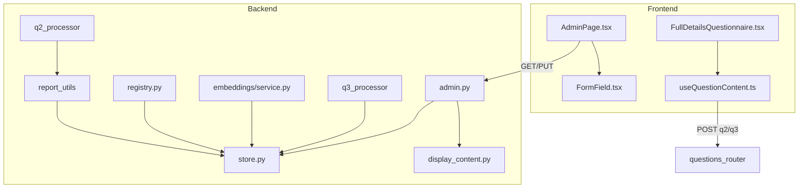

# Functional & Integration Audit — Admin Revamp & Recent Features

**Scope:** Admin page revamp (API key removal, default prompts, textarea sizing), admin API, settings store, dependent consumers.

---

## Phase 1: Deep Integration Analysis

### Blast Radius

| File | Consumers / Dependents |
|------|------------------------|
| `frontend/src/pages/AdminPage.tsx` | App (route) |
| `backend/app/routers/admin.py` | main (router), AdminPage (fetch) |
| `backend/app/settings/store.py` | admin, registry, embeddings, q3_processor, report_utils |
| `backend/app/prompts/display_content.py` | admin, settings/store, q2_processor, q3_processor |
| `docs/development/standards.md` | Reference (example test asserts `apiKey` in GET) |
| `docs/api/README.md` | API documentation |

### Individual File Inspection

| File | Logic Bottlenecks | Silent Failures | Continuity |
|------|-------------------|-----------------|------------|
| AdminPage.tsx | None | No error boundary; fetch errors surface to user | OK |
| admin.py | None | PUT response leaks apiKey | GET strips apiKey; PUT does not |
| store.py | None | None | OK |
| display_content | None | None | OK |

### Cross-File State Desyncs

- **GET vs PUT response shape**: GET omits `apiKey`; PUT returns full `update_settings()` including `apiKey`. Inconsistent; PUT can leak key.
- **Docs vs implementation**: `development/standards.md` test expects `apiKey` in GET response; implementation now omits it.

---

## Phase 2: Problem & Solution Report

**STOP — Awaiting approval before Phase 3 (fixes).**

---

### Issue 1: [admin.py — API Key Leak in PUT Response]

| Field | Value |
|-------|-------|
| **Problem** | `admin_update_settings` returns `update_settings(updates)` directly. That includes `apiKey`. Any client (e.g. DevTools, API consumer) that inspects the PUT response receives the API key. |
| **Root Cause** | Line 48: `return update_settings(updates)` returns the full merged dict. GET strips `apiKey` (line 23); PUT does not. |
| **Impact** | Low if only Admin UI is used and response is ignored. Medium if API is consumed programmatically or response is logged. |
| **Solution** | After `result = update_settings(updates)`, pop `apiKey` before returning: `result.pop("apiKey", None); return result`. |

---

### Issue 2: [docs/development/standards.md — Test Assertion Break]

| Field | Value |
|-------|-------|
| **Problem** | Example test `test_admin_settings` asserts `assert "apiKey" in data`. Admin GET no longer returns `apiKey`. Test would fail if executed. |
| **Root Cause** | Docs/standards.md line 294: `assert "apiKey" in data`. Admin revamp intentionally removed apiKey from GET. |
| **Impact** | Low — example code in docs; may not be run. Anyone copying it would get a failing test. |
| **Solution** | Update assertion to: `assert "policyExcerpt" in data` and `assert "q2PromptTemplate" in data` (or remove apiKey assertion). |

---

### Issue 3: [docs/api/README.md — Outdated Admin Schema]

| Field | Value |
|-------|-------|
| **Problem** | API docs state GET response includes `apiKey`. Implementation omits it. Doc also implies apiKey is still a configurable Admin field. |
| **Root Cause** | Docs not updated after Admin revamp (apiKey removed from UI and GET response). |
| **Impact** | Low — misleading for API consumers. |
| **Solution** | Update GET response example to remove `apiKey` and add `defaultQ2PromptTemplate`, `defaultQ3PromptTemplate`, `defaultPolicyExcerpt`. Add note that apiKey is backend-only (env). |

---

### Issue 4: [AdminPage.tsx — Error Boundary]

| Field | Value |
|-------|-------|
| **Problem** | N/A. |
| **Root Cause** | App.tsx wraps the app in `ErrorBoundary`. AdminPage is covered. |
| **Impact** | None. |
| **Solution** | No change needed. |

---

### Issue 5: [admin.py — PUT Response Missing Default Prompts]

| Field | Value |
|-------|-------|
| **Problem** | GET returns `defaultQ2PromptTemplate`, `defaultQ3PromptTemplate`, `defaultPolicyExcerpt`. PUT returns raw `update_settings()` output, which does not include these. Frontend does not use PUT response, so no functional break. |
| **Root Cause** | PUT handler returns `update_settings(updates)` without adding default prompt keys. |
| **Impact** | None for current UI. Minor inconsistency for API consumers expecting same shape as GET. |
| **Solution** | Optional: Add default prompts to PUT response for consistency. Low priority. |

---

## Summary Table

| ID | Severity | Category | File(s) |
|----|----------|----------|---------|
| 1 | Medium | Security | admin.py |
| 2 | Low | Continuity | development/standards.md |
| 3 | Low | Documentation | api/README.md |
| 4 | — | N/A | App has ErrorBoundary; AdminPage covered |
| 5 | Trivial | Consistency | admin.py (optional) |

---

## Recommendation

**Implement fixes for Issues 1, 2, 3.** Issue 5 is optional.

---

**Approval required before Phase 3 (execution).**

---

## Phase 3: Fixes Applied

| ID | Fix |
|----|-----|
| 1 | `admin_update_settings` now strips `apiKey` from response; adds default prompts to PUT response for consistency |
| 2 | `development/standards.md` test assertion updated: `policyExcerpt`, `q2PromptTemplate`, `defaultQ2PromptTemplate` |
| 3 | `api/README.md` GET/PUT docs updated: no apiKey in request/response; default prompt fields documented; backend-only note |
